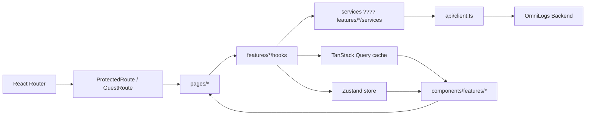
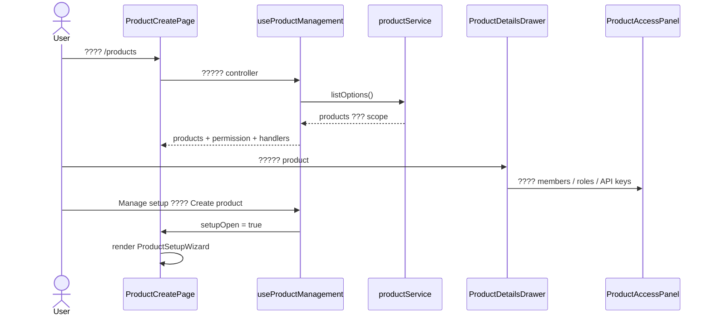
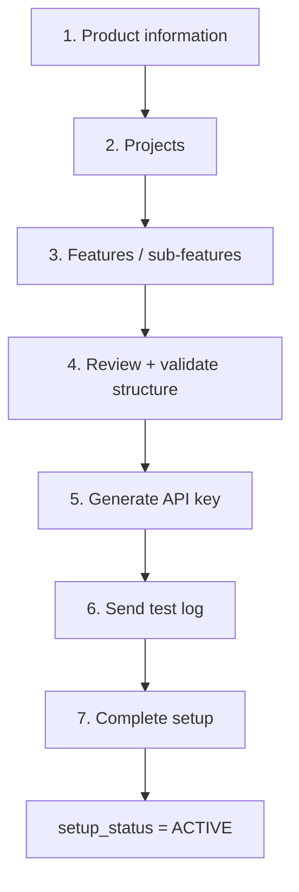
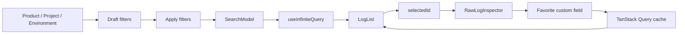
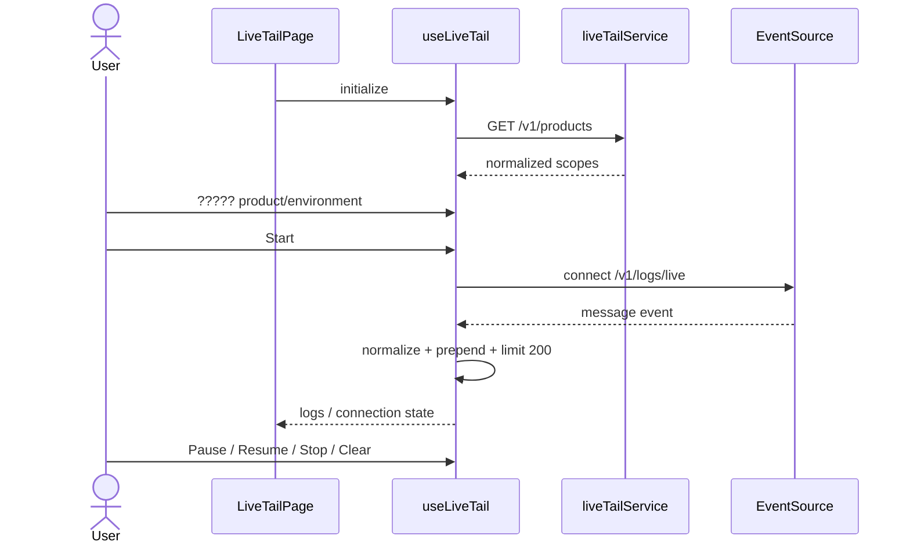

# ??????? Refactor Frontend ??? Flow ????????

???????????????????????????? frontend ??? OmniLogs ???? refactor ??????????????????????????????????????????????? ????????????????????? `frontend/src` ??? demo ?? `frontend/ui` ??????????????????? lint ???????? ???? backend ????????????????????????? contract

## 1. ??????????????????

?????????????? 4 ???

1. ??? route-level page ????????????????????? ?????? API, state ??? JSX ??????????????????????
2. ??? presentation components ?????? `src/components` ?????? business/data logic ?????? `src/features`
3. ??? type, hook, service, schema ??? utility ?????????? ??????????????????????? kebab-case
4. ????????????????? ?????????? TypeScript, ESLint ??? production build ????

??????????? refactor:

| ??????? | ???? | ???? | ????????????? |
| --- | ---: | ---: | --- |
| `LiveTailPage.tsx` | 380 ?????? | 44 ?????? | hook, service, normalizer, header, scope filters, log list |
| `ProductCreatePage.tsx` | 356 ?????? | 75 ?????? | management hook, mapping utils, header, summary, table, drawer |
| `VisualLogSearchBuilder.tsx` | 396 ?????? | 33 ?????? | controller hook, favorite hook, header, workspace |
| `ProductSetupWizard.tsx` | 358 ?????? | 36 ?????? | workflow hook ??? step renderer |
| `FloatingDockNavbar.tsx` | 354 ?????? | 62 ?????? | dock hook, bar ??? menu |
| `FeatureHierarchyStep.tsx` | 342 ?????? | 170 ?????? | editor hook, tree node title ??? editor modal |

???? refactor ????????? TypeScript/TSX ???? 300 ?????? ??????????????????? `ProjectBuilderStep.tsx` ????? 299 ??????

## 2. ???????????????

```text
src/
  pages/                     route-level orchestration
  components/
    global/                  UI ??????? feature ??????????
    features/<feature>/      presentation components ???????? feature
  features/<feature>/
    hooks/                   state, query ??? workflow controller
    services/                HTTP-facing operations ????? feature
    store/                   Zustand client/workflow state
    schemas/                 Zod validation
    types/                   domain/feature types
    utils/                   pure transformation ??? validation
  services/                  domain services ????????????????
  api/                       Axios client, auth header, 401/403 handling
  store/                     session ??? application UI state
  utils/                     utility ???????????????? feature
```

????????????????????????:

- ??????? JSX ??????????????????? ????????? `components`
- ??????? state/query/workflow ??? feature ????????? `features/<feature>/hooks`
- ???????? HTTP ????????? service ???????? Axios ??? component
- ???????????????????????? validation ???????? side effect ????????? `utils`
- page ?????????????? controller ????????? components ????????
- backend authorization ??????? security boundary; frontend permission ???????????????????????????

## 3. ?????? flow ??????



??????????????????????????????:

1. Router ????? route ??????? session/permission guard
2. page ????? controller hook ??? feature
3. controller ???? scope, store ???????? service ???? TanStack Query
4. service ??? request ???? `apiClient` ???????? bearer token ????????? 401/403
5. controller ???????????????????????????? props ?? presentation components
6. mutation ?????????? invalidate/update query cache ???????? UI ??????????????

## 4. ???????????????

### 4.1 Route-level pages

| ???? | ??????? |
| --- | --- |
| `src/pages/ProductCreatePage.tsx` | ????????????????? products ??? setup wizard ????????? management components |
| `src/pages/LiveTailPage.tsx` | ?????? header, scope selector, error state ??? live log list |
| `src/pages/LogsExplorePage.tsx` | route wrapper ??? Log Explorer |
| `src/pages/AuditLogsPage.tsx` | ??? audit filters/query/table ??????? detail drawer |
| `src/routes/routes.tsx` | ????? authenticated routes |
| `src/routes/AppRoutes.tsx` | ?????? public/protected routes ??? loading progress |

### 4.2 Components ??????? feature

```text
src/components/features/
  audit-logs/
    AuditLogFiltersCard.tsx
    AuditLogTableCard.tsx
    AuditLogDetailDrawer.tsx
  live-tail/
    LiveTailHeader.tsx
    LiveTailScopeFilters.tsx
    LiveLogList.tsx
  log-explorer/
    LogExplorerHeader.tsx
    LogExplorerWorkspace.tsx
    SearchPanel.tsx
    LogList.tsx
    RawLogInspector.tsx
    JsonTree.tsx
    SummaryCard.tsx
  logs-connections/
    ConnectionHeader.tsx
    ConnectionSummary.tsx
    ApiKeyTable.tsx
    ApiKeyDetailDrawer.tsx
    GenerateApiKeyDrawer.tsx
    GeneratedSecretDialog.tsx
    ConnectionGuide.tsx
  product-management/
    ProductManagementHeader.tsx
    ProductManagementSummary.tsx
    ProductManagementTable.tsx
    ProductDetailsDrawer.tsx
    ProductAccessPanel.tsx
  product-setup/
    ProductSetupStepContent.tsx
    SetupStepper.tsx
    SetupNavigation.tsx
    ProductInformationStep.tsx
    ProjectBuilderStep.tsx
    FeatureHierarchyStep.tsx
    FeatureTreeNodeTitle.tsx
    FeatureEditorModal.tsx
    ProductReviewStep.tsx
    ApiKeyStep.tsx
    ConnectionGuideStep.tsx
    SetupCompleteStep.tsx
```

`src/components/features/logs-explorer-legacy` ?????? UI ???????????? import ??? route ???????? ???????????????????????????????? ???????????????????????????????????????? feature

### 4.3 Feature logic

| ??????? | ??????? |
| --- | --- |
| `src/features/product-management/hooks/useProductManagement.ts` | ??? list query, search, drawer, setup mode ??? generated-secret handoff |
| `src/features/product-management/utils/productManagement.ts` | ???? Product API model ???? Product Setup draft ??? format role badge |
| `src/features/product-setup/hooks/useProductSetupWizard.ts` | orchestration ??? setup ???? 7 steps |
| `src/features/product-setup/hooks/useFeatureHierarchyEditor.ts` | state ??? CRUD ???? client ??? feature tree editor |
| `src/features/product-setup/services/productSetup.service.ts` | typed API operations ?????? product/project/feature/API key/setup |
| `src/features/log-explorer/hooks/useLogExplorerController.ts` | scope, filters, infinite query, selection ??? inspector state |
| `src/features/log-explorer/hooks/useLogExplorerFavorites.ts` | favorite custom fields, optimistic reorder ??? cache recovery |
| `src/features/live-tail/hooks/useLiveTail.ts` | product query, EventSource lifecycle, pause/resume ??? log window |
| `src/features/live-tail/services/liveTail.service.ts` | ???? product scopes ???? apiClient |
| `src/features/live-tail/utils/liveTailNormalizer.ts` | normalize snake_case/camelCase API ??? SSE payload |

### 4.4 Utilities ????

| ???? | ??????? |
| --- | --- |
| `src/utils/error.ts` | ???? unknown/Axios error ???????????????????????? UI |
| `src/utils/userNormalizer.ts` | normalize user API response ????? envelope ?????????? |
| `src/utils/userDisplay.ts` | ????? user-id ? display-name map ???????????? Audit |
| `src/utils/permission.ts` | permission helpers ?????????? feature |
| `src/utils/formatter.ts` | format ?????? ?????? ???????????????? |

## 5. Flow: Product Management ??? Product Setup

### 5.1 Product Management



????????:

- `useSetupPermissions` ??????????????????????? create/manage
- `toProductSetupDraft()` ?????????? product ???????????? wizard
- generated API key ?????????????????????? drawer ??? ???????? `GeneratedSecretDialog` ???? drawer ??????? ??????????? modal ???????
- product list ??? query key `["products", "management"]` ??? refetch ???????????? wizard

### 5.2 Product Setup 7 ????



??????????????????:

- `ProductSetupWizard.tsx` ??? stepper, content ??? navigation
- `ProductSetupStepContent.tsx` ????? component ??? `currentStepIndex`
- `useProductSetupWizard.ts` ?? create/update/sync/validate/generate/complete
- `productSetup.store.ts` ???? draft, projects, features, generated key ??? test result ???? step
- `useSetupValidation.ts` ????? `canContinue` ??????????????????????????
- `productSetup.service.ts` ?????????????????? endpoint ??? response contracts

???? project ??? feature ??????? sync ?????????????????????? database ID/???????? code ?? backend ???????????????????????? ???? feature ????? root ???? child ????? resolve `parent_id` ??????????

## 6. Flow: Log Explorer



??????????:

- ?????????????? draft filters ???? ???????????????????? query ???? Search
- `applyFilters()` ?????? draft ?? applied state ???????? `searchRevision`
- natural text search ??????????? condition ??? `payload.message contains ...`
- `useInfiniteQuery` ??????????? 100 records ??? `LogList` ????? `loadMore`
- auto refresh ????? Off/3/5/10/30 ??????
- favorite reorder update cache ???????????? UI ???????????? ??? API ????????? invalidate cache ??????? error
- inspector width ?????? Zustand store ?????????????????? render ??? feature

## 7. Flow: Live Tail



????????????????:

- `liveTail.service.ts` ???? products ????????? component ????? Axios
- `liveTailNormalizer.ts` ?????? payload ???? snake_case ??? camelCase
- `useLiveTail.ts` ????/??? EventSource, ???? connection state ???????? log window 200 ??????
- pause ??? ref ????????????????????????? reconnect stream
- `LiveLogList.tsx` ????????? log, timestamp, message, trace/request/status/latency

## 8. Flow: Audit Logs

1. `AuditLogsPage` ???? filter draft, pagination ??? selected audit ID
2. `auditService.list(filters)` ????????????? server-side
3. `AuditLogFiltersCard` ??????? filter ??? reset page ??????????????
4. `AuditLogTableCard` ???? loading/error/empty/table/pagination
5. ????????????? `AuditLogDetailDrawer` ???? detail ??? audit ID
6. `buildUserDisplayMap()` ??????? page ??? drawer ????????????? actor ?????????????

## 9. Navigation ??? shared components

`FloatingDockNavbar` ?????????????:

- `src/hooks/useFloatingDock.tsx` ? open/close/timer/outside click/Escape/navigation/logout
- `FloatingDockBar.tsx` ? brand, quick links, profile ??? toggle
- `FloatingDockMenu.tsx` ? navigation groups ??? active item
- `FloatingDockNavbar.tsx` ? animation shell ???????????????????????

`DatePicker.tsx` ??????????? React components ???????? Fast Refresh ???????????? ???? Ant Design-compatible composite `DatePicker.RangePicker` ?????? `DatePickerComposite.ts`

`SearchBar` ?????????? controlled ??? uncontrolled mode ??? derive ????????????? props ?????? ?????????? sync state ?? effect

## 10. ???????????????????

?????? `frontend/`:

```bash
npm run lint
npm run build
```

????????:

- ESLint ???????? `frontend/src` ??? `frontend/ui`
- TypeScript project build ????
- Vite production build ????
- ????? import path ??????? component folders ???????
- ????????? `.ts`/`.tsx` ???? 300 ??????

???????????? build: bundle ????????????? 1.9 MB ???? gzip ??? Vite ????? chunk ???????? 500 kB ?????????????? ????????????????????????????? route-level lazy loading/manual chunks

## 11. ??????????? feature ????

????????????????? `Retention Policies`:

```text
src/pages/RetentionPoliciesPage.tsx
src/components/features/retention-policies/
  RetentionPolicyHeader.tsx
  RetentionPolicyTable.tsx
  RetentionPolicyDrawer.tsx
src/features/retention-policies/
  hooks/useRetentionPolicies.ts
  services/retentionPolicy.service.ts
  schemas/retentionPolicy.schema.ts
  types/retentionPolicy.types.ts
  utils/retentionPolicy.ts
```

???????????? route constant, route config, navigation item, permission guard ??? query keys ????????? Axios call ?? page/component

## 12. ??????????????????? 5?7 ????

1. ?????????: page ???? 350?400 ?????? ??? UI, API, state ??? transformation
2. ??????????????: page ????????????, component ??????, hook ??? flow, service ?????? API, utils ??????????
3. ????????????? `components/features` ??? `features` ?????????????????? presentation ??? business logic
4. ????? Product Setup flow 7 ???? ?????? `ProductSetupWizard` 36 ??????
5. ????? Log Explorer: draft filters ? SearchModel ? infinite query ? inspector
6. ????? Live Tail: scope ? EventSource ? normalize ? 200-log window
7. ?????????????: lint/build ???? ????????????? 300 ?????? ??????? route code splitting ????????????

## 13. ?????????????????

- ????? route-level lazy loading ??????? initial bundle
- ????? component/hook tests ??? Product Setup, Log Explorer ??? Live Tail
- ???????????????????? `logs-explorer-legacy` ?????? production source
- ????? runtime response schemas ?????? API ??? security-sensitive
- ????????? browser ??? 320px, 375px, tablet ??? keyboard-only ??? checklist ??? project
